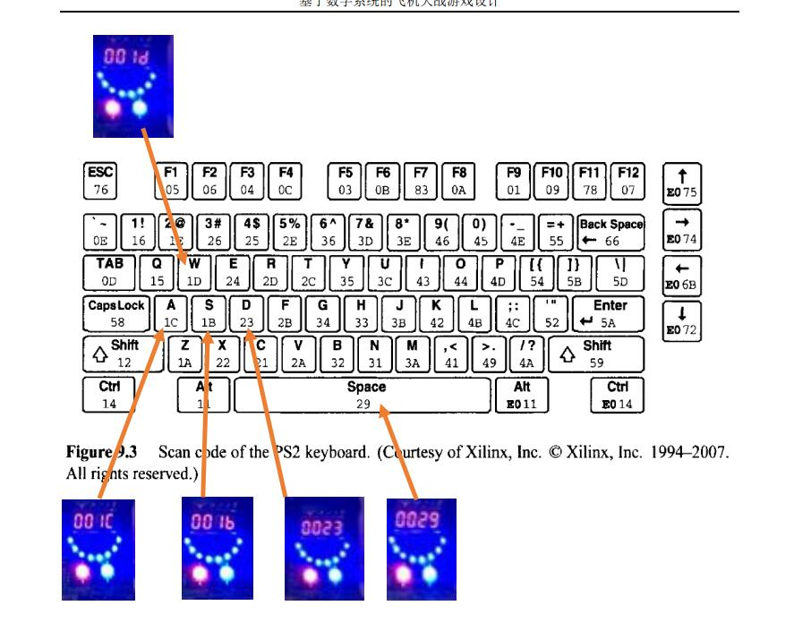

将 `ps2.v` 加到文件里。

Top 模块新增输入

```verilog
input ps2_clk,
input ps2_data,
```

ucf 中新增引脚

```
NET "ps2_clk"									LOC = N18		| IOSTANDARD = LVCMOS33;
NET "ps2_data"									LOC = M19  		| IOSTANDARD = LVCMOS33;
```

需要使用的地方新建实例

```verilog
wire [9:0] keyb;
wire keybR;
ps2 k1 (.clk(clk), .rst((~rstn)), .ps2_clk(ps2_clk), .ps2_data(ps2_data), .data_out(keyb), .ready(keybR));
```

其中 `keyb` 的**后 8 位** `keyb[7:0]` 的含义如下图：



当按下按键时，`keyb[9]` 为 1，`keyb[7:0]` 为上图对应内容，`keybR` 为 1；当松开时， `keyb[9]` 为 0，`keyb[7:0]` 为上图对应内容，`keybR` 为 1。